# Value Stream Simulator


Stop value leaks in your software delivery pipeline.

The [Iron Triangle of Software Development](https://www.ambysoft.com/essays/brokenTriangle.html) describes how quality is affected by trade-offs made between delivery speed, resources, and scope.  Demanding that a small development team delivers "everything" by "Friday" risks quality, while hiring a large team of superstars _might_ result in higher quality, but at a significantly higher project cost.

While the adoption of best practices such as automated testing and continuous delivery promises major benefits, this needs to be taken in context.  For some organizations, achieving daily releases of code with 100% unit test coverage may not be largest opportunity for improvement.

Value Stream Simulator is a tool that models a software delivery ecosystem then distills its effectiveness to a single metric: _loss_.  Loss is the depreciation of a feature's value from the time its need is identified to the time it is delivered and used.  Lower loss is indicative of greater efficiency.  By comparing the outcomes of different models, informed decisions on improvements can be made.

## Installation

1. Install prerequisites:
* Python >= 3.11: 
  * [MacOS](https://docs.python.org/3/using/mac.html#)
  * [Windows](https://www.python.org/downloads/windows/)
  * [Linux](https://docs.python.org/3/using/unix.html)

* [Node 22 or 24](https://nodejs.org/en/download)

* [uv](https://docs.astral.sh/uv/getting-started/installation/#standalone-installer)

2. Clone this repository and cd to its root
```shell
git clone https://github.com/bvett/value-stream-simulator.git
cd value-stream-simulator
```

3. Create and load a virtual environment:
  * Linux/Mac:
```shell
uv venv .venv
source .venv/bin/activate
```
  * Windows:
```shell
uv venv .venv
.venv\Scripts\activate
```
4. Install Dependencies
```shell
uv sync
uv pip install -e .
```

5. Install Front-End Components
```shell
npm ci --prefix src/value_stream/app/frontend
npm run build --prefix src/value_stream/app/frontend
```

6. Start the application
```shell
python -m value_stream.app
```


## Quick Start
Simulations are performed by processing a set of tasks through one or more delivery ecosystems.  The effectiveness of each is expressed in terms of loss - both net loss (delivered value of the tasks) and process-oriented loss (specific origins of loss).

Comparing outcomes enables targeted improvements that result in the greatest reduction of loss.

To perform a basic simulation:

1. Open the [Value Stream Simulation Studio](http://127.0.0.1:8081).  If prompted, select _Start a New Workspace_.
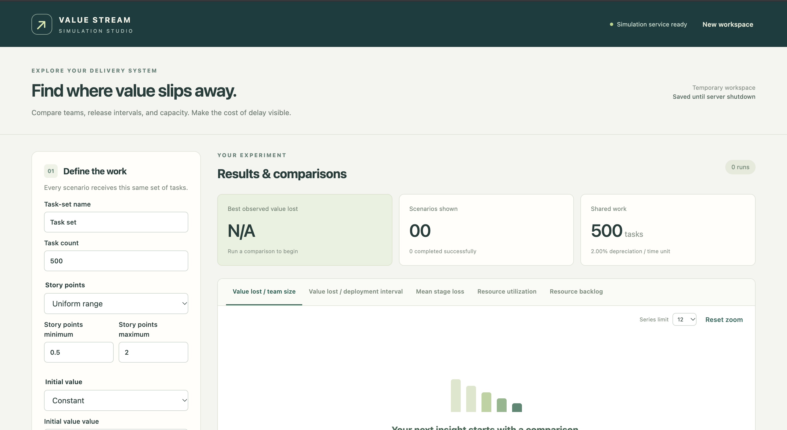
2. Leave team sizes at 1, 13, 25.  Leave task count at 500
3. Scroll to the bottom of the left-side panel.  Press **Preview Sweep**, then **Run 9 Scenarios**
4. Review the results:

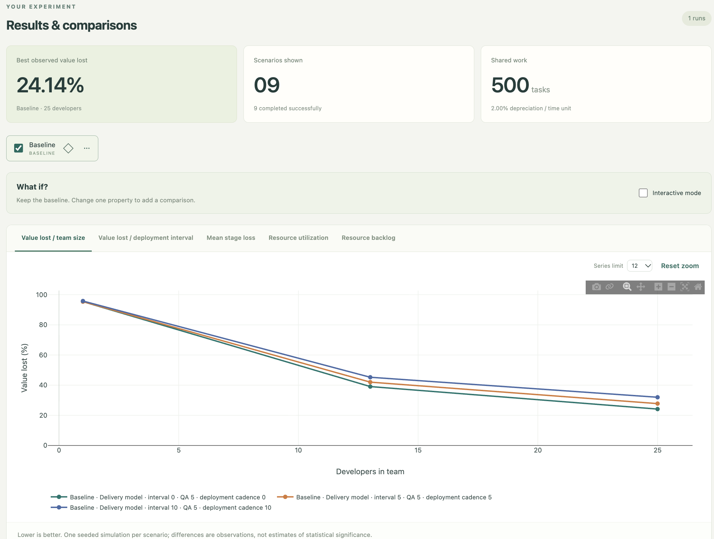

For a deeper understanding of usage, refer to the following sections:
1. [Define the Work](#define-the-work)
2. [Shape the Delivery System](#shape-the-delivery-system)
3. [Preview Sweep](#preview-sweep)
4. [Run Scenarios](#run-scenarios)
5. [View Results](#view-results)
6. [Other Features](#other-features)

## Usage

Open the [Value Stream Simulation Studio](http://127.0.0.1:8081):


### Define the Work
This panel describes a workload as a set of tasks.  A task is defined by _story points_ (relative complexity), and _initial value_.  

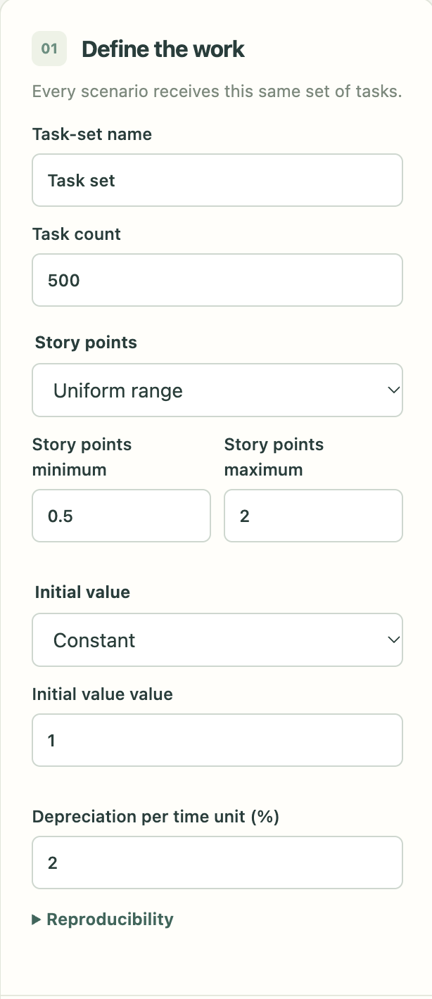

### Shape the Delivery System

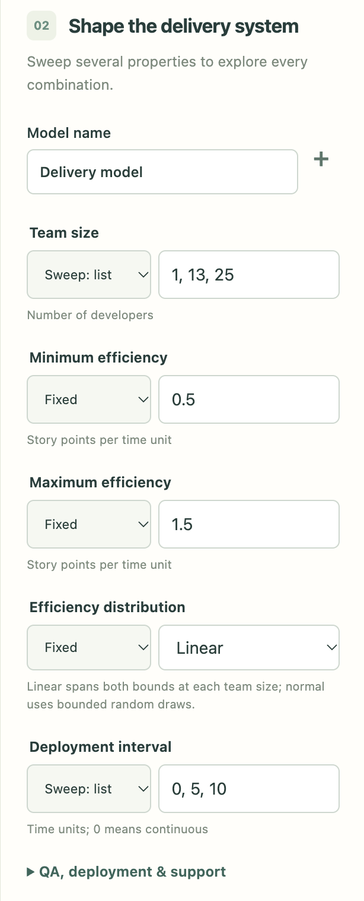

This is where most of work is done when creating scenarios. For the first tour, use the defaults and proceed to the next section.

A delivery system is defined by:
* **Development Team**: 
  * **Team Size** 
  * Developer efficiency distribution across the team.
* **QA**: 
  * **QA Pool Size**: Concurrency of qa testing
  * **QA Time per Story Point**: Time cost for qa testing, expressed as a fraction of the task's story points.
  * **QA Failure Rate (%)**: Percentage of qa tests that fail.  Tasks that fail QA are reassigned to the associated developer.
  * **QA Rework (%)**: Effort required to fix the QA failure.  Expressed as a percentage of task story points 
* **Deployment**:   
  * **Deployment Interval**: Period of deployments. (0=continuous delivery)
  * **Deployment Pool Size**: Number of deployments that can happen simultaneously.
  * **Deployment Duration**: Time consumed by a deployment.
  * **Deployment Failure Rate (%)**: Percentage of deployments that fail and need to be retried.
* **Support**:
  * **Support Interval**: Period (expressed in simulation time units) of support task generation.  Support tasks are randomly assigned to a developer for immediate action, interrupting (and delaying) any work-in-progress.
  * **Support Task Effort**: Number of story points for a support task.


### Preview Sweep
Properties of the [delivery system](#shape-the-delivery-system), can be expressed in the following ways:

* **Fixed**:  Single value
* **Sweep-list**: One or more arbitrary values
* **Sweep-range**: Set of values defined by min/max/step.

To execute a simulation, you must first press **Preview Sweep**, which generates a set of scenarios representing all combinations of properties expressed as a 'sweep'.

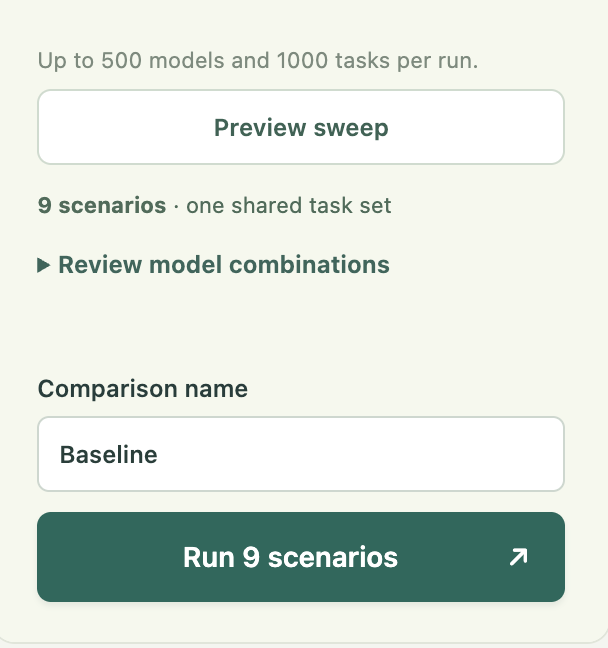


After pressing **Preview Sweep** you can expand 'Review Model Combinations' for details on the generated scenarios.

### Run Scenarios
Pressing **Run (X) Scenarios** initiates a simulation for each scenario.  As simulations complete, the plots are updated with the results.  The **Scenario Results** table maintains the state of each scenario, including any errors.

### View Results


A scenarios complete, results are rendered in a series of plots, accessible via the tabs on the *Results & Comparisons* panel:

* [Value Lost vs Team Size](#value-lost-vs-team-size)
* [Value Lost vs Deployment Interval](#value-lost-vs-deployment-interval)
* [Mean Stage Loss](#mean-stage-loss)
* [Resource Utilization](#resource-utilization)
* [Resource Backlog](#resource-backlog)

#### Value Lost vs Team Size
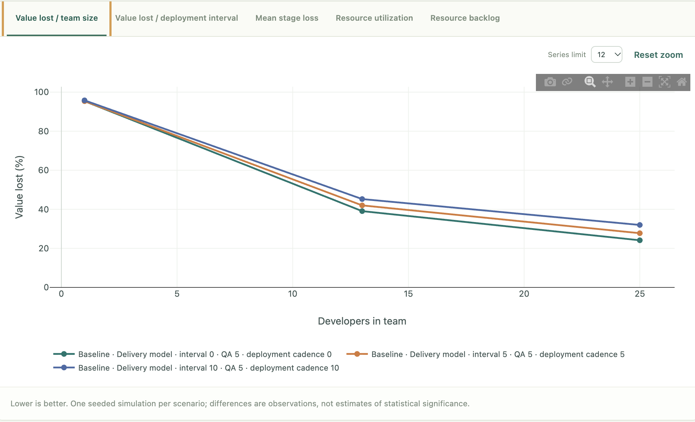

This plot shows how team size affects loss.  Unsurprisingly, when creating scenarios using the defaults, it shows loss is reduced by having larger development teams.   By plotting deployment cadence as separate series, it (also unsurprisingly) shows the gains that come from releasing more often. The benefits of frequent releases are greater when applied to larger teams, due to having more tasks completing development and waiting for the next deployment window.

_"Okay..."_, you may be thinking, _"larger teams releasing frequently means less loss. I already knew that, so what's the purpose of this plot?"_

Fair question, but recall this plot is using rather simplistic inputs.   In more complicated and realistic scenarios, it can help identify whether the incremental benefit of additional development resources justifies the associated cost.   It can also provide a counterintuitive view, highlighting cases where development capacity is not the largest source of loss.

#### Value Lost vs Deployment Interval
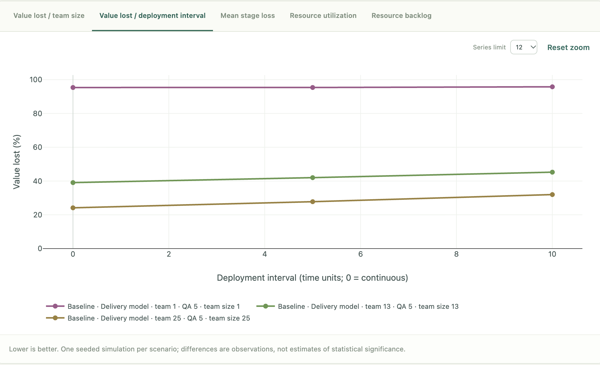

This plot is a pivot of [Value Lost vs Team Size](#value-lost-vs-team-size), showing how loss is affected by release cadence.  While the reductions in loss are not as significant compared with scaling up a development team, adoption of a shorter deployment interval (higher release frequency) can be achieved at a comparatively lower cost.

As with the previous example, the purpose of this plot isn't to render a common understanding, but rather to provide insight when a scenario produces a counterintuitive result.

#### Mean Stage Loss
Where [Value Lost vs Team Size](#value-lost-vs-team-size) and [Value Lost vs. Deployment Interval](#value-lost-vs-deployment-interval) provide a summary view of loss for each scenario, _Mean Stage Loss_ provides an introspective view on where loss is occurring within a scenario:

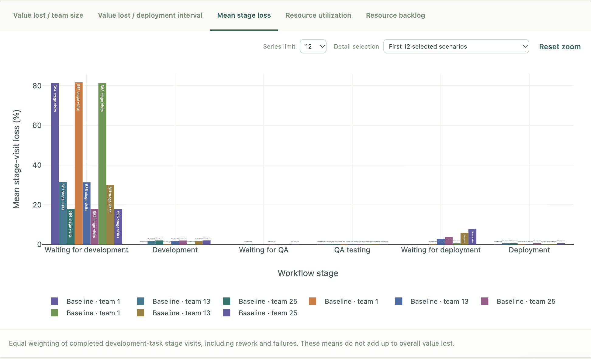

The simulation processes the tasks through a workflow that models the software development lifecycle:


The plot provides a breakdown of loss by workflow stage.  Use the _Detail selection_ dropdown to compare individual scenarios.  For example, choose the scenario representing _deployment cadence=0, team size=1_:

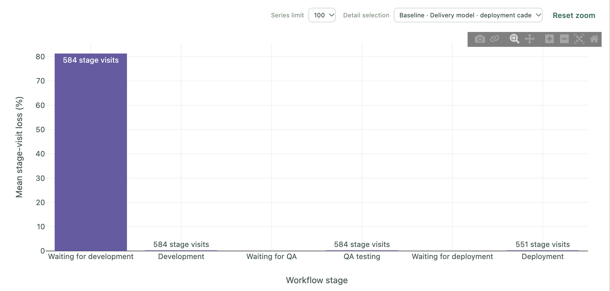

This is showing how 80% of value is lost in the 'Waiting for Development' state, likely because having a single developer working on 500 tasks is going to take some time!

Now, choose _deployment cadence=10, team_size=25_ :

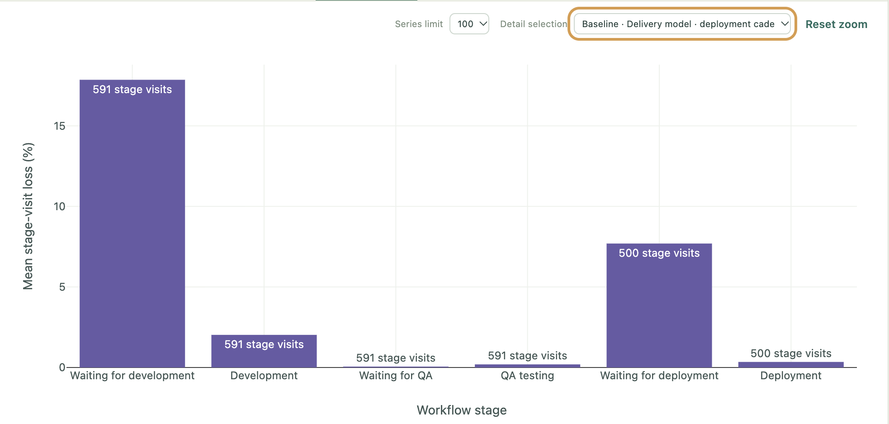

While the greatest loss is still happening in the _Waiting for Development_ state, at around 18% it's significantly less given the much larger pool of development resources.  But also notice the loss happening further down the pipeline - the increased throughput of development effort results in about 7.5% loss in _Waiting for Deployment_.  This highlights the amount of value wasted by having complete features waiting for a release window.  (Switch to _deployment cadence=0, team size=25_ to see what difference continuous delivery makes in this case.)

#### Resource Utilization
Where [Mean Stage Loss](#mean-stage-loss) seeks to highlight areas where perhaps additional resource allocation is needed, _Resource Utilization_ provides a view of how allocated resources are being used.

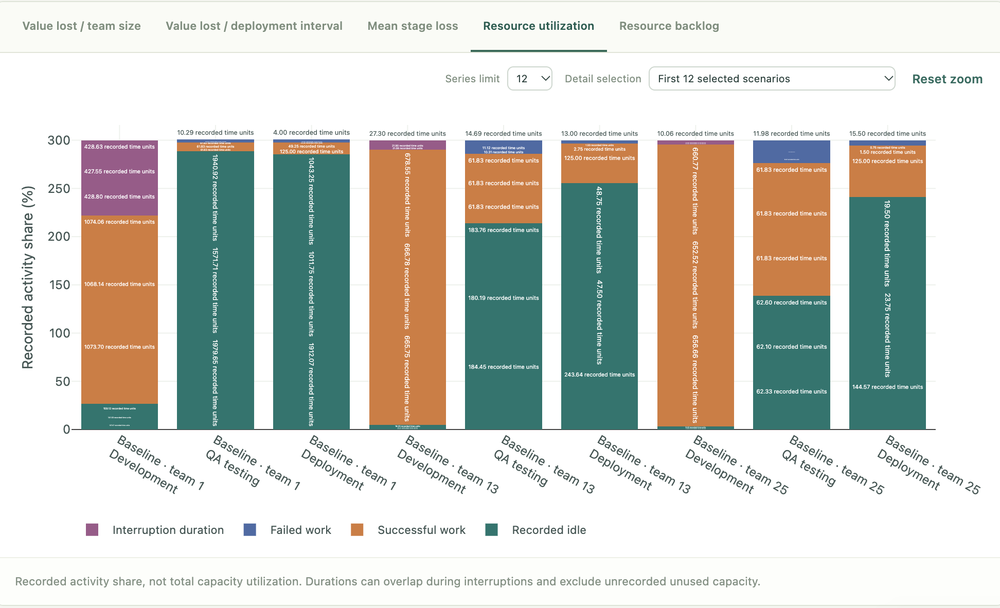

A _Resource_ operates on a task by moving it between stages of the task workflow. Examples include developers, QA testers (both manual and automated), and deployment.  Resource utilization can be optimized by examining the percentage of time a resource spends in the following states:
* **Successful Work** : Resource is operating on a task.
* **Failed Work** : Effort was spent on a task with an unsuccessful outcome - such as a failed deployment or failed QA test.
* **Idle** : Resource is waiting for a task to operate on.
* **Interrupted** : Resource had to pause work-in-progress in order to address an unplanned task.  Example includes a developer who receives a support escalation.

As with the previous example, use the _Detail selection_ dropdown to compare the _deployment cadence=0, team size=1_ and _deployment cadence=10, team size=25_ scenarios:

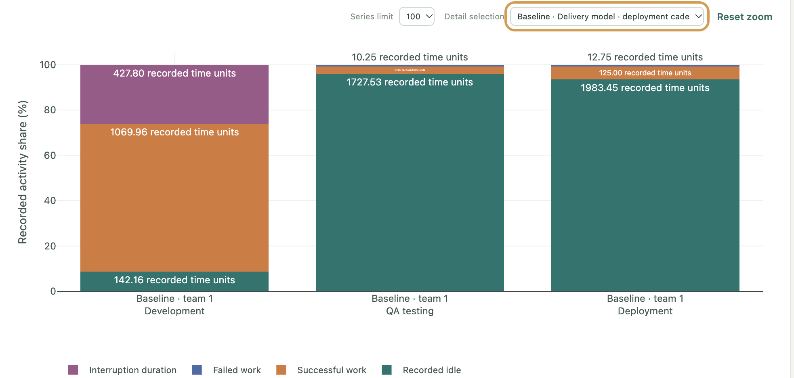

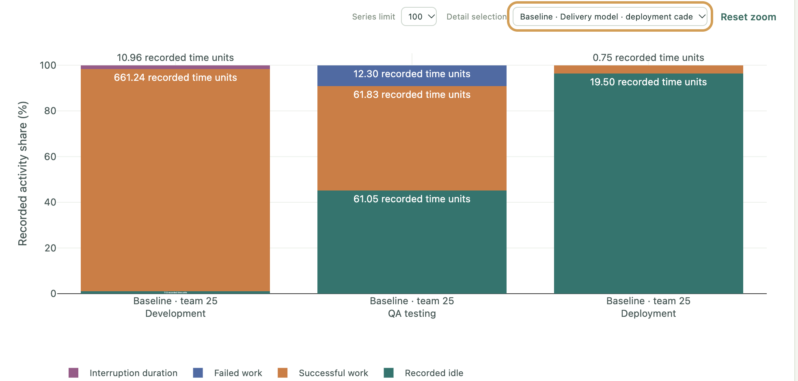

Notice how the smaller team size spends a significantly greater percentage of time in an "interrupted" state (about 25%).  This reflects how a steady support burden (1 issue every 5 units of time) is more easily absorbed by a larger team.  This doesn't mean that a larger development team is the only way to improve here - the other way to interpret this is that you can achieve up to 25% increase in developer efficiency by understanding and reducing the amount of support.

This comparison also shows how, in the 1-developer scenario, the QA testing stage is over-resourced (idle about 95% of the time).  This isn't as much of a problem if QA testing is automated, but could point to a cost optimization opportunity if QA testing is manually performed.


#### Resource Backlog
Resource backlog counts waiting **resource requests** over time, and will generally mirror the results presented in [Mean Stage Loss](#mean-stage-loss):

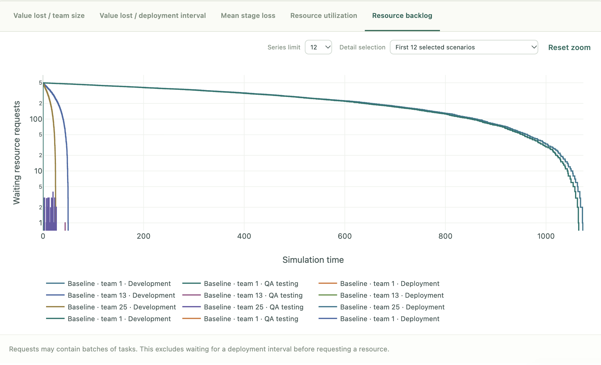

Note that the Y-Axis scale is logarithmic, to help represent both the numerically larger backlogs that occur waiting for development resources, versus the queues that form waiting for QA or deployment resources.


#### Interactive Mode
Ticking _Interactive Mode_ in the _What If_ panel enables side-by-side comparison of simulation results.  When active, you can adjust a single property to observe how it affects the outcome.

For example, you can compare how [Value Lost vs Team Size](#value-lost-vs-team-size) is affected when the maximum developer efficiency is turned up to 11:

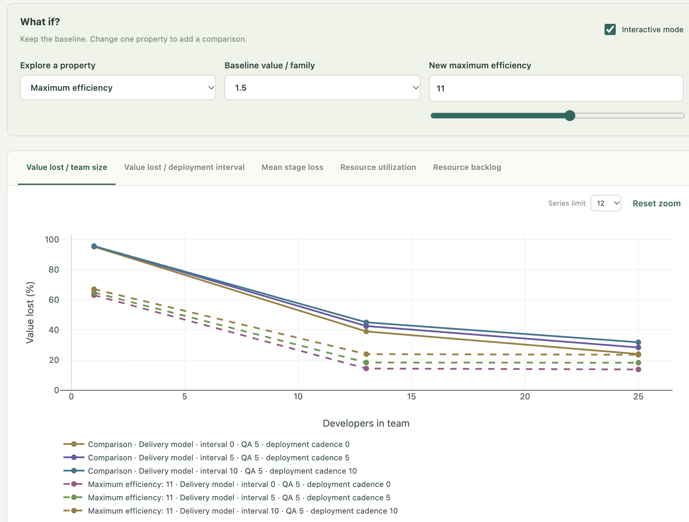


### Other Features

#### Results Interpretation
The _What the Results Suggest_ panel is a placeholder for providing actionable insights based on the simulation results. 

#### Data Download
The _Scenario Results_ panel contains links for downloading of summary, event, and resource datasets as CSVs.

## Project Status and Roadmap

This project is very much a work-in-progress and contains features that are incomplete and evolving.

### Near-Term Objectives
* Introduce resource cost.  Enables comparisons of value gained by adding resources vs. cost of resources.

* Emulate sprints.  Currently, simulations process a single batch of tasks.  Being able to introduce multiple workloads over time will provide a more realistic view on resource utilization.

* Introduce _failure rate_ as a task property, which is adjustedthroughout a simulation by the adoption of best practices and presence of antipatterns.  Replace the fixed-interval generation of support with generation triggered by post-delivery task failures.

* Provide insight on when paying down technical debt provides more value than feature work.

* Introduce task dependencies/bundles.  Simulates tightly-coupled architectures, where a failure in one component necessitates delay or rollback of otherwise healthy features.

### Roadmap
* Add persistence layer

* Utilize machine-learning for optimization.

* Replace hard-coded SDLC workflow with workflow engine

* Extensibility.  Enable workflows, plots, resources, best practices, and other stability modifiers to be config-driven.

* Provide data-source integration option for simulation properties.  Enable simulations to be partially-based off of actual, observed metrics.

### Non-Goals
* This project does not offer a process or framework by which to perform value-stream mapping within an organization.  It's focused on providing an understanding how properties of the SDLC and delivery ecosystem impact the value of delivered features.

## License
This project is covered by the [MIT License](LICENSE).
