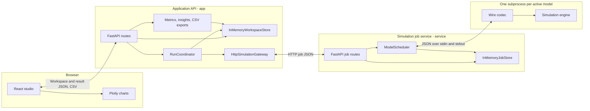
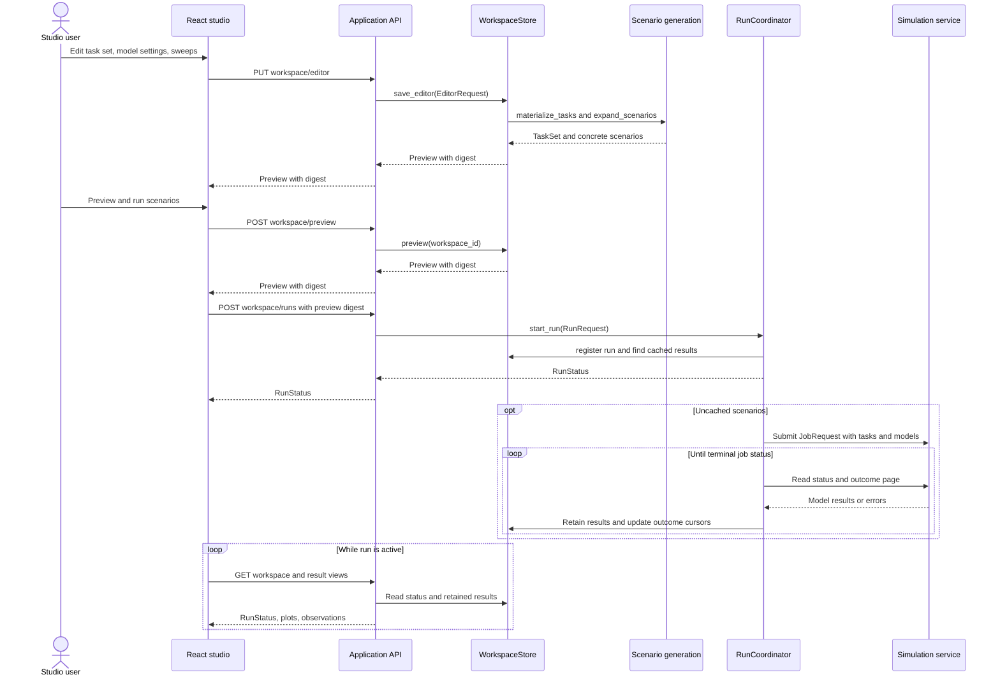
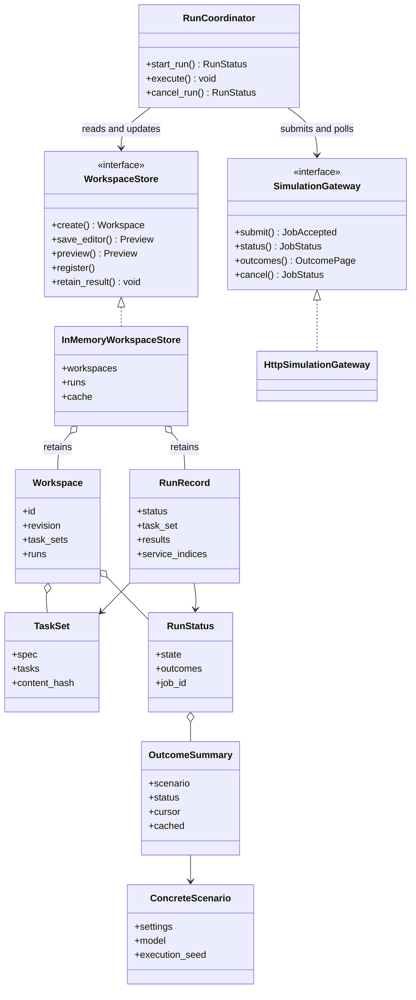
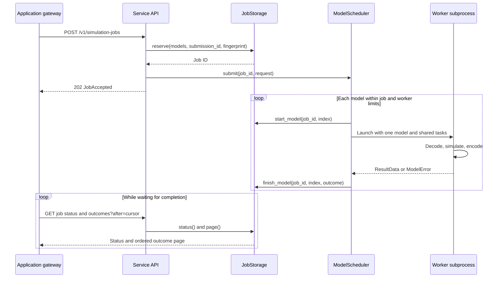
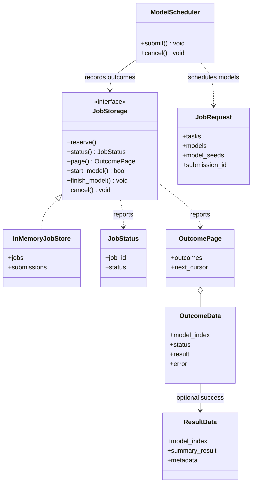
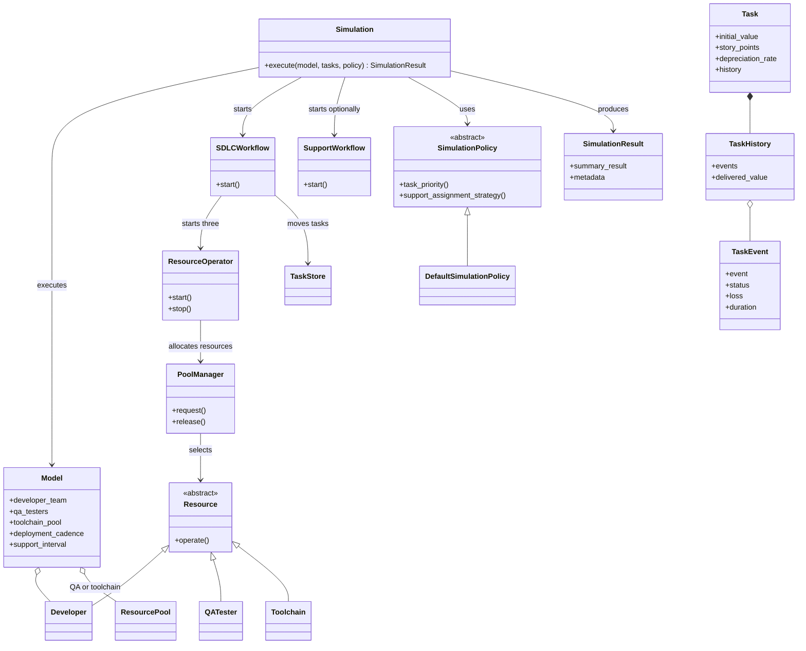
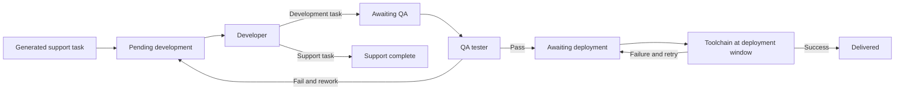

# Architecture Diagrams

These diagrams describe the current implementation in `src/value_stream/`. The
**application** (`app/`) serves the studio UI and owns workspaces and comparisons.
The **simulation service** (`service/`) accepts bounded jobs and runs each model
in a worker subprocess. The application can start a loopback service in its own
process, or connect to an external one with `VALUE_STREAM_SERVICE_URL`. In both
cases, the boundary between them is HTTP. Both stores are in memory; restarting
either server loses its state.

## System architecture

The frontend calls only the application API. `app/frontend/src/types.ts` wraps
the generated API types; `app/server.py` defines the browser routes. The job
service has its own contract in `service/schemas.py` and `service/app.py`.

## Application: editor to comparison

The preview digest guards against running stale editor inputs. A run can reuse
cached scenario results; only uncached models are sent to the service. The
browser polls the workspace, while the coordinator polls service outcomes.

## Application: principal classes

`WorkspaceStore` and `SimulationGateway` are Python protocols, so implementations
can be replaced without changing the coordinator. `ConcreteScenario.model` is
the service wire model, built from the editor's `ModelSettings`.

## Simulation service: job execution

The scheduler limits active jobs and model workers, queues excess accepted jobs,
and applies a per-model timeout. Submission IDs make retries idempotent when the
payload matches. The outcome cursor lets clients request only newer results.

## Simulation service: principal classes

`service/worker.py` is the subprocess entry point. `service/codec.py` translates
wire models to simulation objects and translates completed results back to wire
data. Each worker receives one model, even when a job requests many models.

## Simulation engine: principal classes

`Simulation.execute()` creates a fresh SimPy environment for a model. Its
workflow creates development, QA, and deployment operators, then waits for all
original development tasks to reach delivery. Support work can interrupt
developers without increasing that delivery target.

## Task flow inside one simulation

The queued boxes correspond to `TaskStore` instances in `SDLCWorkflow`. The
three work boxes are `ResourceOperator` stages using `Developer`, `QATester`,
and `Toolchain`. Task events and resource tracking feed summary, stage loss,
utilization, and backlog views after the simulation completes.
